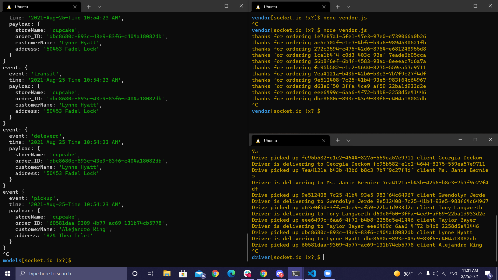
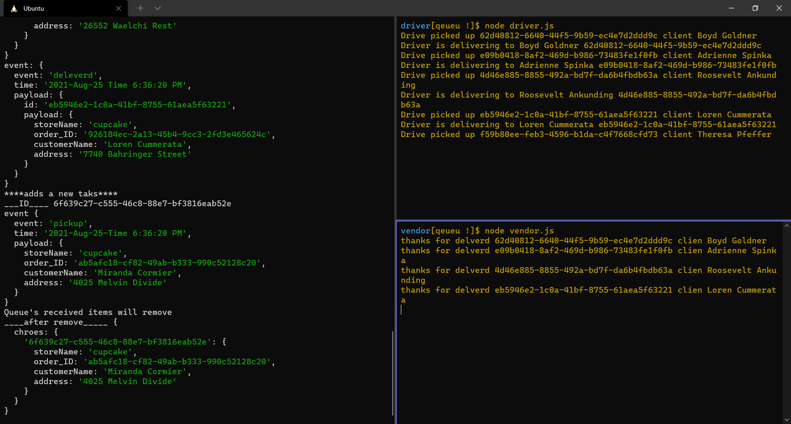

# CAPS

---

---

###### Setup

### `.env`

> STORENAME=

---

###### Running the app:

- #### `npm start` , `nodemon`

- #### Technical Requirements / Notes
  
- `events.js` - Global Event Pool (shared by all modules)
- `caps.js` - Main Hub Application

---
#### execute
    > node caps.js

#### Tests

Unit Tests:

queue results

---

